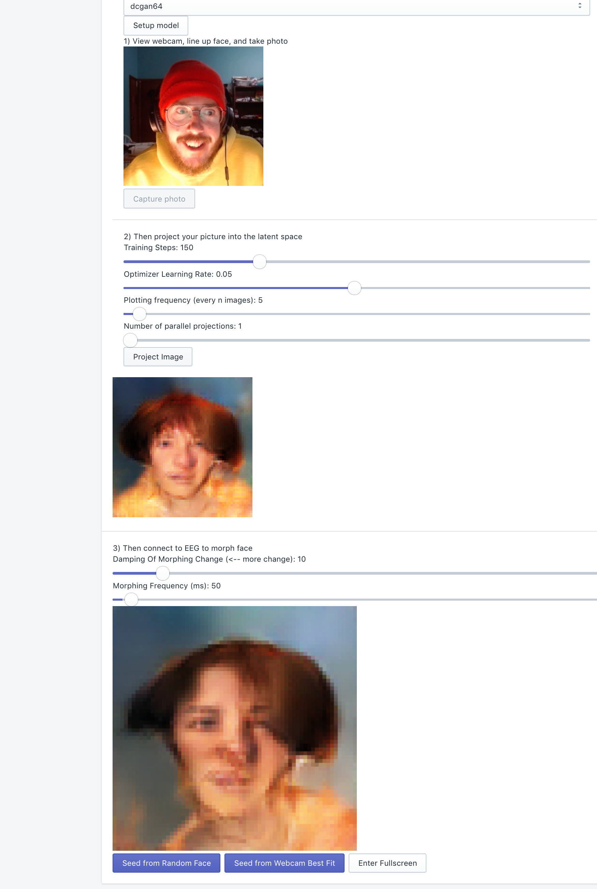

# FaceOff
Latent GAN State Brain Surfer

The brain is full of all the patterns we could ever need
live at https://faceoff.eegedu.com

<p align="center">

</p>

FaceOff is an interactive art piece focused on the relationship between real and artificial brains. You will use your webcam to take in image of your face, and allow an artificial intelligence to find a digital match, a barcode that matches your face. You will then use your own brain waves to make slight changes in this digital barcode, and watch as your face morphs before your eyes.

<p align="center">

</p>

# Stack

EEG - 
https://choosemuse.com/
https://github.com/urish/muse-js
https://github.com/neurosity/eeg-pipes
https://github.com/kylemath/eegedu

UX
https://github.com/facebook/react
https://github.com/Shopify/polaris-react
https://www.npmjs.com/package/react-full-screen

Webcam
https://www.npmjs.com/package/react-webcam

Machine Learning:
https://github.com/tensorflow/tfjs

Deploy:
https://github.com/firebase/

# Plan and Inspiration

https://colab.research.google.com/drive/17HvdPhwhe1cmkTWnA50vyOmMlWHhg6_P?usp=sharing

https://alantian.github.io/ganshowcase/

latence space brain surfer

start as webapp

tensorflow.js? load a pretrained model, input vectors to it, output images

then we can connect with bluetoothweb and use muse-js and neurosity-pipes

plus this video at this moment Trash | Off the Air | adult swimTrash | Off the Air | adult swim

https://youtu.be/BGSUYAKquBU?t=114

Amazing... then we connect with talkgenerator.com and watch our thoughts

ok hardest part first how does EEG stack connect to tensorflow.js output vector from eeg stack input to tensorflow

pulling out the five elements alpha beta gamma delta kapa and then pipe that right in

yeah specifically the "pipe in" how does a live tensorflow compute work

we could use peoples webcams to seed it isntead you can project an image into the latent space and find nearest approximation but it takes a few seconds


# Installation for Development 

If you are interested in developing, here are some instructions to get the software running on your system. *Note*: Currently development requires a Mac OSX operating system. 

To start, you will need to install [Homebrew](https://brew.sh) and [yarn](https://yarnpkg.com/lang/en/docs/install/#mac-stable). These are easy to install with the following Terminal / `bash` commands:

```sh
## Install homebrew
/usr/bin/ruby -e "$(curl -fsSL https://raw.githubusercontent.com/Homebrew/install/master/install)"

## Install yarn
# NOTE: this will also install Node.js if it is not already installed.
brew install yarn 

# NOTE: Node.js must be version 10.x for Muse interaction

# Thus, if you are getting version issues, install n, with the following command:
# sudo npm install -g n

# Then, you can switch to version 10.x with the following command:
# sudo n 10.16.0
```

Then, in Terminal/`bash`, clone this Git repository and change directory into the newly cloned folder:

```sh
git clone https://github.com/kylemath/lags-bs
cd EEGEdu
```

Then, you can install the required `yarn` packages:

```sh
yarn install
```

## Local Development Environment
Then, you can run the *Local Development Environment*:

```sh
yarn start dev
```

If it is working correctly, the application will automatically open in a browser window at http://localhost:3000.


## Local Production Environment

To start the *Local Production Environment*, you can use the following commands: 

```sh
yarn cache clean
yarn run build
serve -s build
```

## Local Testing of Changes

1. Install any new packages `yarn install`
1. Start the *Local Development Environment* `yarn start dev`
1. Look for errors in terminal log
1. Open's browser to http://localhost:3000
1. Open Javascript console
1. Look for errors in console
1. Connect Mock data stream by clicking Connect button
1. step through website features while reading console

## Deployment

[FaceOff](https://faceoff.eegedu.com) is running on [Firebase](https://firebase.google.com/) and deployment happens automagically using GitHub post-commit hooks, or [Actions](https://github.com/kylemath/Faceoff/actions), as they are commonly called. You can see how the application is build and deployed by [inspecting the workflow](https://github.com/kylemath/Faceoff/blob/master/.github/workflows/workflow.yml). 

Currently this automagic deployment is not working, so we can deploy to firebase manually:

First, install the Firebase deployment tools:

```sh
sudo brew install firebase
sudo yarn global add firebase-tools
sudo yarn global add firebase
```

The first deployment requires login and initialization once:

```sh
firebase login
```

Browser opens, and login to Google account authorized for Firebase deployment:

```sh
firebase init
```

* options: Hosting Sites only
* public directory: build
* single-page app: No
* Overwrite - No
* Overwrite - No

Then, deployment to Firebase happens with the following commands:

```sh
# clean the local cache to ensure most recent version is served
yarn cache clean

# build the latest version of the site
yarn run build

# deploy the latest version to firebase
firebase deploy
```

